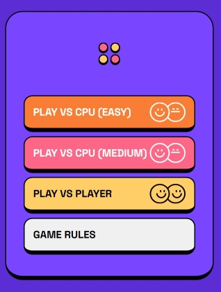
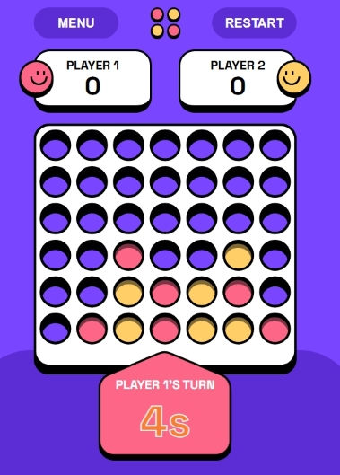
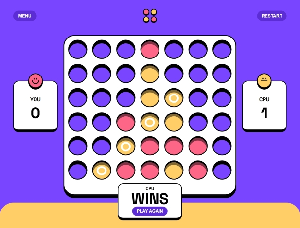

# Connect Four Game

Connect Four is a strategic two-player game where players take turns dropping pieces into a grid, aiming to get four in a row before their opponent. This implementation offers smooth animations, responsive gameplay, and CPU opponents with varying difficulty levels for a balanced challenge.

With an intuitive interface and polished design, this version brings a modern, accessible experience to one of the most beloved classic games. Some unique features of this project includes:

- **Animated piece drops** for a dynamic visual experience

- **CPU difficulty levels** that adapt to different play styles

- **Responsive layout** ensuring seamless gameplay on different screen sizes

## Table of contents

- [Overview](#overview)
  - [The challenge](#the-challenge)
  - [Screenshot](#screenshot)
  - [Links](#links)
- [My process](#my-process)
  - [Built with](#built-with)
  - [What I learned](#what-i-learned)
  - [Continued development](#continued-development)
  - [Useful resources](#useful-resources)
- [Author](#author)
- [Acknowledgments](#acknowledgments)

## Overview

### The challenge

The goal of this project was to create a fully interactive Connect Four game with smooth animations, responsive design, and a challenging CPU opponent. The biggest hurdles included:

- **Game Logic:** Implementing a system to detect winning conditions across rows, columns, and diagonals efficiently.

- **AI Strategy:** Designing an opponent that adapts its difficulty, making the experience engaging for players.

- **Animations & User Experience:** Ensuring smooth transitions, intuitive interactions, and visually appealing game states.

### Screenshot





### Links

- Solution URL: [GitHub repo](https://github.com/BlackiePearlJoobi/connect-four-game.git)
- Live Site URL: [GitHub Pages](https://blackiepearljoobi.github.io/connect-four-game/)

## My process

### Built with

- Semantic HTML5 markup (via TSX in React)
- Component-level CSS (custom properties, `flexbox`, animations, etc.)
- React (Context API, `useState`, `useEffect`, etc.)
- Typescript
- Vite

### What I learned

#### HTML (TSX in React)

The Connect Four pieces are dynamically rendered using React’s TSX, ensuring modularity while maintaining a semantic structure.

```tsx
type Color = "red" | "yellow" | "blank";
type PieceProps = {
  id: string;
  color: Color;
};

const Piece = ({ id, color }: PieceProps) => {
  return color === "blank" ? null : (
    <div
      className={`piece ${id === lastPlacedId && !hasAppeared[id] && "drop-animation"}`}
      color={color}
    >
      
    </div>
  );
};
```

**Key Features:**

- **Reusable Component Structure:** Piece represents a single game piece, ensuring consistent rendering throughout the board.

- **Conditional Rendering:** If `color === "blank"`, the component returns null, preventing unnecessary DOM elements.

- **Semantic Markup via TSX:** The <div> encapsulates each piece while an  visually represents the game token.

- **Dynamic Class Management:** The drop-animation class is conditionally applied when a new piece is placed.

#### CSS

This project leverages CSS animations, layering techniques, and responsive styling to create a polished and engaging user experience.

```css
@keyframes drop {
  0% {
    transform: translateY(-100vh);
    opacity: 0;
  }
  100% {
    transform: translateY(0);
    opacity: 1;
  }
}

@keyframes fadeIn {
  0% {
    opacity: 0;
  }
  100% {
    opacity: 1;
  }
}

.game-board-container {
  position: relative;

  .game-board-back {
    z-index: 0;
    background-image: url(/assets/images/board-layer-black-small.svg);
  }

  .game-board-middle {
    z-index: 1;
    position: absolute;
    top: 3%;
    left: 2%;

    .square {
      position: relative;

      .piece {
        .piece-image {
        }
      }

      .drop-animation {
        animation: drop 0.2s ease-out;
      }

      .circle {
        z-index: 1;
        position: absolute;
        top: 41%;
        left: 50%;
        transform: translate(-50%, -50%);
        animation: fadeIn 0.5s linear forwards;
        animation-delay: 0.2s;
      }
    }
  }

  .game-board-front {
    z-index: 2;
    position: absolute;
    top: 0;
    left: 0;
    background-image: url(/assets/images/board-layer-white-small.svg);
  }

  .game-board-surface {
    z-index: 4;
    position: absolute;
    top: 3%;
    left: 2%;

    .column {
      .marker {
      }
    }
  }
}
```

**Game Board Styling**

The `.game-board-container` is structured with multiple layers:

- `.game-board-back`: Represents the lowest layer, using z-index: 0.

- `.game-board-middle`: Houses the individual squares and game pieces, positioned absolutely for precise placement.

- `.game-board-front`: The topmost visual layer, ensuring a clean and structured board appearance.

- `.game-board-surface`: Captures user interactions, such as piece placement and hover markers.

**Animations & Transitions**

Smooth animations enhance gameplay responsiveness:

- **Piece Drop Animation** (`drop 0.2s ease-out`): Adds a dynamic falling motion when a piece is placed.

- **Fade-in Effect** (`fadeIn 0.5s linear with delay`): Highlights winning pieces with a subtle transition.

#### React: Context API

This project utilizes Context API to efficiently manage game state across components, reducing prop drilling and ensuring a scalable architecture.

**How Context API is Used**

- **Global State Management:** Stores game-related values like `setOpponent`, `isInMainMenu`, and turn tracking.

- **Centralized Logic:** Ensures all components access and update game state seamlessly.

- **Efficient Performance:** Context reduces unnecessary re-renders compared to passing props deeply.

```tsx
import { createContext, useState, useContext } from "react";

type OpponentType = "CPU_easy" | "CPU_medium" | "human" | null;

interface GameContextType {
  opponent: OpponentType;
  setOpponent: (x: OpponentType) => void;
  isInMainMenu: boolean;
  setIsInMainMenu: (x: boolean) => void;
}

const GameContext = createContext<GameContextType | undefined>(undefined);

export const GameProvider = ({ children }: { children: React.ReactNode }) => {
  const [opponent, setOpponent] = useState<OpponentType>(null);

  const [isInMainMenu, setIsInMainMenu] = useState(true);

  return (
    <GameContext.Provider
      value={{
        opponent,
        setOpponent,
        isInMainMenu,
        setIsInMainMenu,
      }}
    >
      {children}
    </GameContext.Provider>
  );
};

export const useGameContext = () => {
  const context = useContext(GameContext);
  if (!context) {
    throw new Error("useGameContext must be used within GameProvider");
  }
  return context;
};
```

#### React: Detecting Winning Conditions

To determine the game's outcome, this project implements an efficient **win detection system** that checks for four consecutive pieces in **rows, columns, and diagonals.**

**How It Works**

Each placed piece triggers a check based on its position, ensuring minimal unnecessary calculations:

- **Row Check:** Iterates through the same row to identify consecutive matches.

- **Column Check:** Scans vertically from the bottom up.

- **Diagonal Checks:** Traverses diagonals from both left and right angles.

**Example: Row Check**

```tsx
const checkRow = (id: string): boolean => {
  const row = parseInt(id.charAt(0));
  let currentColumn = 1;
  const targetColor = isLeftTurn ? "red" : "yellow";
  let series = 0;

  while (currentColumn <= 7) {
    const currentSquareId = `${row}${currentColumn}`;

    if (pieceColors[currentSquareId] === targetColor) {
      series++;
      if (series >= 4) return true;
    } else {
      series = 0;
    }
    currentColumn++;
  }
  return false;
};
```

#### React: State Management

The `InGame` component manages multiple aspects of gameplay using React's useState hook, tracking turns, scores, board state, and animations dynamically.

**Key State Variables**

- **Turn Tracking:** `isLeftTurn` determines whose turn it is.

- **Win Detection:** `hasLeftWon`, `hasRightWon`, and `isDraw` signal game outcomes.

- **Score Management:** `leftScore` and `rightScore` update based on wins.

- **Piece Placement:** `pieceColors`, `columnLevels`, and `lastPlacedId` store board positions dynamically.

- **Animations & UI:** `hasAppeared` prevents repeated animations, while `isHovered` manages column markers.

- **Timer Logic:** `timer` and `isTimerRunning` track countdown functionality.

**Example: Handling Piece Placement**

```tsx
const updatePieceColors = (col: number): void => {
  if (columnLevels[col] === 6 || hasLeftWon || hasRightWon || isDraw) return;

  const targetSquareId = ((columnLevels[col] + 1) * 10 + col).toString();

  setPieceColors((prevColors) => ({
    ...prevColors,
    [targetSquareId]: isLeftTurn ? "red" : "yellow",
  }));
};
```

#### React: CPU Strategy

The CPU opponent in this Connect Four game follows a strategic decision-making process, balancing difficulty levels and engagement for players.

**Difficulty Levels & Decision Logic**

- Priority-based logic:

  1. **Winning moves first** – If the CPU can win in one move, it plays immediately.

  2. **Blocking player moves** – Prevents the opponent from winning when possible.

Otherwise,

- **Easy CPU:** Selects moves randomly without considering strategy.

- **Medium CPU:** Prefers center columns and attempts to build three-piece sequences to set up future wins.

```tsx
const cpuMove = (): void => {
  let targetCol: number | null = null;

  // if center bottom is available, take it
  if (columnLevels[4] === 0) {
    targetCol = 4;
  } else {
    // check for potential consecutive four pieces
    for (let i = 1; i <= 7; i++) {
      // first, check if CPU can win immediately
      if (columnLevels[i] === 6) continue;
      const targetSquareId = ((columnLevels[i] + 1) * 10 + i).toString();

      if (
        simulateRow(targetSquareId, "yellow") >= 4 ||
        simulateColumn(targetSquareId, "yellow") >= 4 ||
        simulateRightDiagonal(targetSquareId, "yellow") >= 4 ||
        simulateLeftDiagonal(targetSquareId, "yellow") >= 4
      ) {
        targetCol = i;
        break;
      }

      // second, block player if they can win next turn
      if (
        simulateRow(targetSquareId, "red") >= 4 ||
        simulateColumn(targetSquareId, "red") >= 4 ||
        simulateRightDiagonal(targetSquareId, "red") >= 4 ||
        simulateLeftDiagonal(targetSquareId, "red") >= 4
      ) {
        targetCol = i;
        break;
      }
    }

    // (Medium) check for potential consecutive three pieces
    if (opponent === "CPU_medium" && !targetCol) {
      for (let i = 1; i <= 7; i++) {
        if (columnLevels[i] === 6) continue;
        const targetSquareId = ((columnLevels[i] + 1) * 10 + i).toString();

        if (
          simulateRow(targetSquareId, "yellow") === 3 ||
          simulateColumn(targetSquareId, "yellow") === 3 ||
          simulateRightDiagonal(targetSquareId, "yellow") === 3 ||
          simulateLeftDiagonal(targetSquareId, "yellow") === 3
        ) {
          targetCol = i;
          break;
        }

        if (
          simulateRow(targetSquareId, "red") === 3 ||
          simulateColumn(targetSquareId, "red") === 3 ||
          simulateRightDiagonal(targetSquareId, "red") === 3 ||
          simulateLeftDiagonal(targetSquareId, "red") === 3
        ) {
          targetCol = i;
          break;
        }
      }
    }

    // (Medium) default: pick a random column but prefer center
    if (opponent === "CPU_medium" && !targetCol) {
      const centerdArr = [
        1, 2, 2, 3, 3, 3, 3, 3, 4, 4, 4, 4, 4, 4, 4, 5, 5, 5, 5, 5, 6, 6, 7,
      ];
      do {
        const index = getRandomInt(0, centerdArr.length - 1);
        targetCol = centerdArr[index];
      } while (columnLevels[targetCol] === 6);
    }

    // (Easy) default: pick a completely random column
    if (!targetCol) {
      do {
        targetCol = getRandomInt(1, 7);
      } while (columnLevels[targetCol] === 6);
    }
  }

  updatePieceColors(targetCol);
  updateLastPlacedId(targetCol);
  updateColumnLevels(targetCol);
  updateHasAppeared(targetCol);
};

const simulateRow = (id: string, color: Color): number => {
  const row = parseInt(id.charAt(0));
  let currentColumn = 1;
  let series = 0;
  let seriesTemp = 0;

  const pieceColorsTemp: { [key: string]: Color } = { ...pieceColors };
  pieceColorsTemp[id] = color;

  while (currentColumn <= 7) {
    const currentSquareId = `${row}${currentColumn}`;

    if (pieceColorsTemp[currentSquareId] === color) {
      seriesTemp++;
      if (seriesTemp > series) series = seriesTemp;
    } else {
      seriesTemp = 0;
    }

    currentColumn++;
  }

  return series;
};
```

### Continued development

While the game is already interactive and polished, future improvements could make it even more engaging:

- Advanced AI Opponents – Refining the CPU movement to analyze more complex strategies.

- Sound Effects – Integrating subtle sounds for piece drops, turn switches, and win celebrations, creating a more dynamic experience.

### Useful resources

During development, I referenced various resources to improve gameplay mechanics and React architecture. Some particularly helpful sites were:

- [Math is Fun – Connect Four](https://www.mathsisfun.com/games/connect4.html) - Helped me familiarize myself with Connect Four mechanics and analyze CPU movement strategies, influencing my approach to AI decision-making.

- [Smashing Magazine – Introduction to React Context API](https://www.smashingmagazine.com/2020/01/introduction-react-context-api/) – Provided in-depth insights into React’s Context API, helping streamline global state management and improve component interaction.

## Author

- Frontend Mentor - [@BlackiePearlJoobi](https://www.frontendmentor.io/profile/BlackiePearlJoobi)
- devChallenges - [@Moonychan](https://devchallenges.io/profile/568d1c62-28c2-40d3-8772-cce03ae0c707)

## Acknowledgments

This is a solution to the [Connect Four game challenge on Frontend Mentor](https://www.frontendmentor.io/challenges/connect-four-game-6G8QVH923s). Frontend Mentor challenges help you improve your coding skills by building realistic projects.
